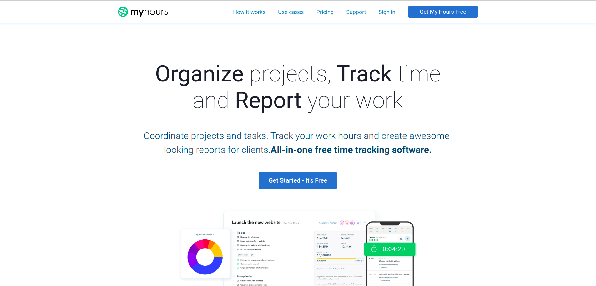
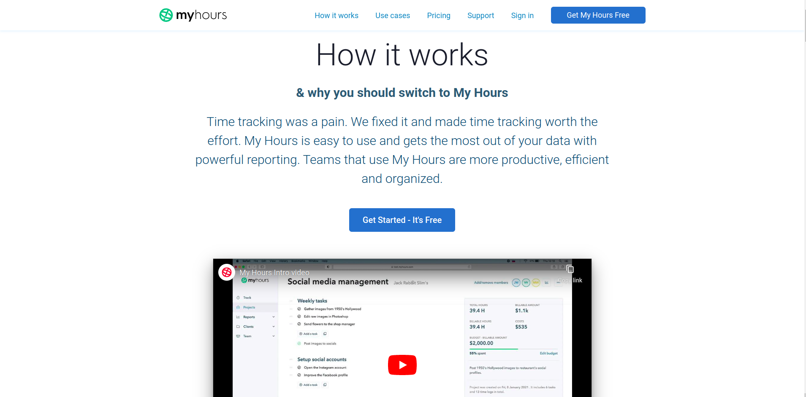
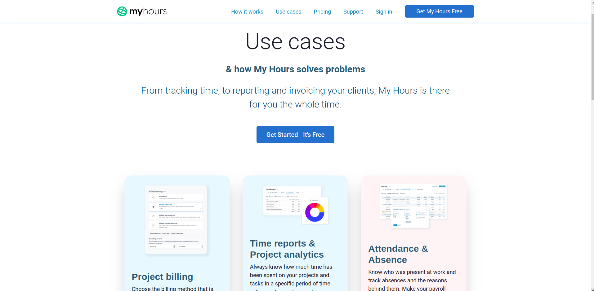
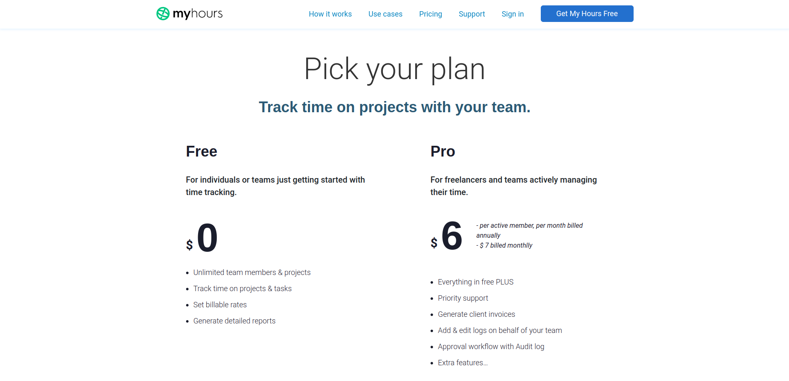
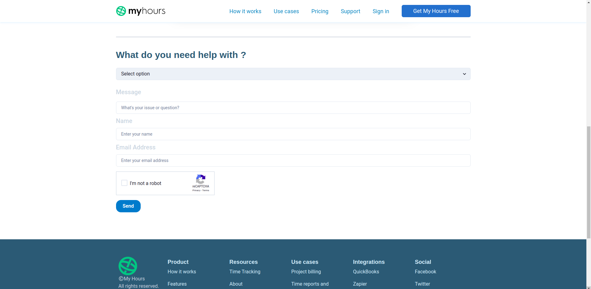
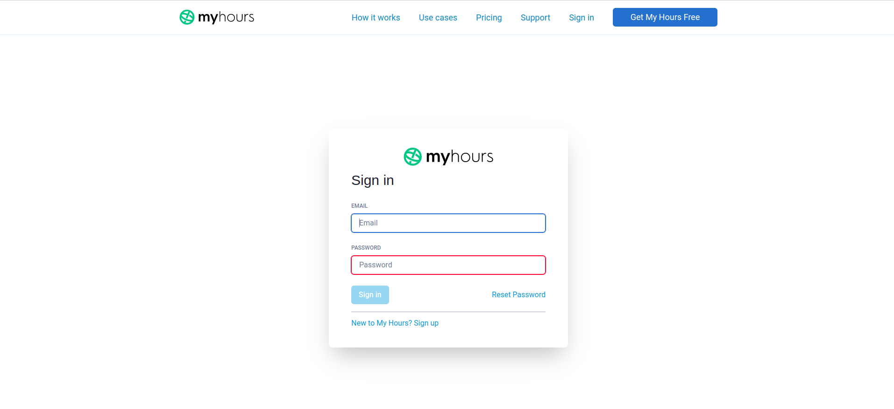
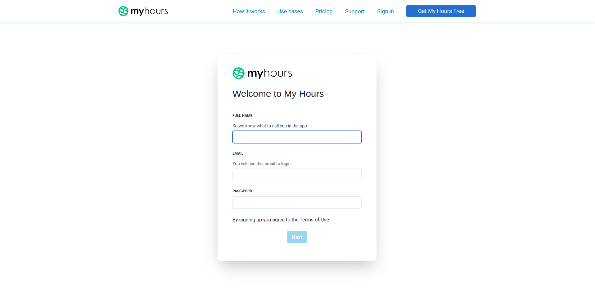
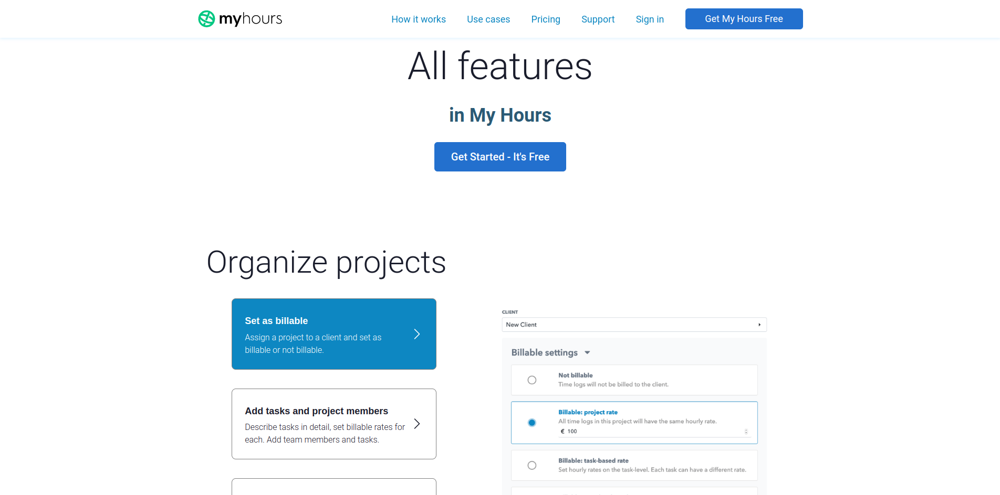
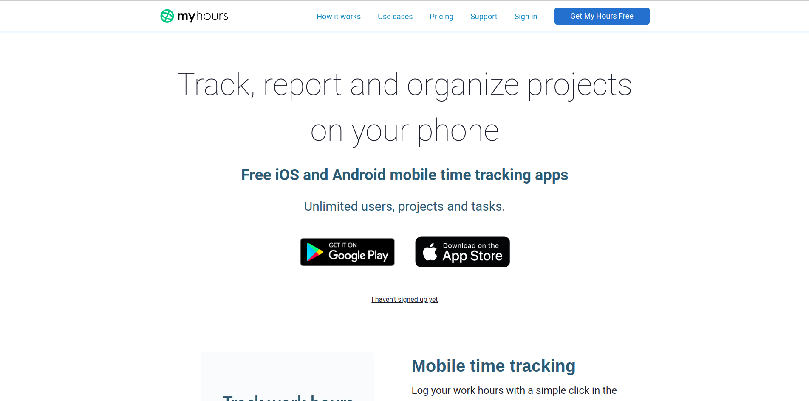
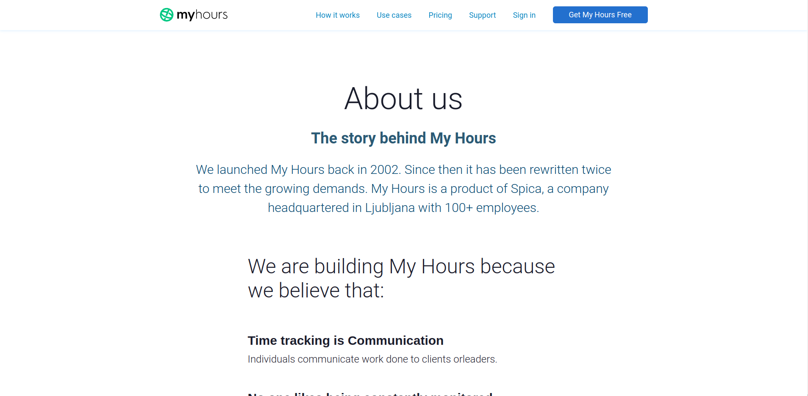

# Myhours website clone

:point_right: Visit the deployed website [here](https://myhours.pages.dev/)

# Tech Stacks

- React
- Chakra UI

 

## 1. Home page

   

 

## 2. How it works page

   

 

## 3. Use cases page

   

    

## 4. Pricing page

   

    

## 5. Support page

   

    

## 6. Sign in page

   

    

## 7. Sign up page

   

    

## 8. Features page

   

    

## 9. Mobile app page

   

    

## 10. About page

 
  
